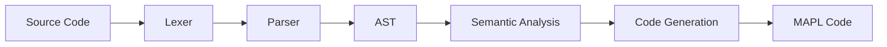

# Implementación de un lenguaje de programación

[English](README.md) | Español

## Descripción

El proyecto implementa un pequeño lenguaje de programación cuya sintaxis está inspirada en TypeScript.

El compilador se basa en las siguientes fases:

1. Análisis léxico
2. Análisis sintáctico
3. Análisis semántico
4. Generación de código

La implementación está escrita en java y usa ANTLR para el parset y MAPL para la generación de código.

**Universidad de Oviedo**
Tercer año del grado en Ingeniería Informática del Software

**Asignatura**: Diseño de Lenguajes de Programación (DLP)

## Ejemplo de uso
```text
	let v:[10]number;

// Main program
function main(): void {
	let value: number;
	let i,j: int;
	let date: [
		let day, month, year:int;		
	];
	
	input date.day; 
	date.year = 'a'; 
	date.month = date.day * date.year % 12 + 1;
	log date.day, '\n', date.month, '\n', (date.year as number), '\n';
	
	input value;
		
	i=0;	
	while (i < 10) {
		v[i] = value;
		log i,':',v[i], ' ';
		if (i % 2)
			log 'o','d','d','\n';
		else
			log 'e','v','e','n','\n';
		i = i + 1;
	}
	log '\n';
	}
}
```

## Descripción del lenguaje

> **Note:** Para más especificaciones al respecto puede consultarse la descripción del lenguaje en la carpeta docs

### Types

- int
- number
- char
- arrays
- records

### Statements

- variable assignment
- if / else
- while
- function invocation
- return
- input / output

### Expressions

- arithmetic operators
- logical operators
- relational operators
- explicit casts
	
## Arquitectura




## Diseño del AST


## Estructura de archivos del proyecto

| File           | Description                                                                                                                                                                      														|
| -------------- | -----------------------------------------------------------------------------------------------------------------------------------------------------------------------------------------------------------------------------------------|
| `docs`   		 | En esta carpeta se encuentran tanto la descripciones del lenguaje dada por el profesor como varios programas de prueba para la comprobación del correcto funcionamiento del lenguaje														|
| `lib`       	 | Al ser un proyecto que casi no tiene dependencias, y a pesar de usar maven, guardamos aquí las dos dependencias principales: antlr e introspector																						|
| `ast`   		 | Contiene las clases del AST hechas en java						                                                                 																										|
| `parser`  	 | Contiene el archivo TSMm.g4 que genera la gramática con sintaxis antlr. Este archivo utiliza el LexerHelper.java para facilitar ciertas conversiones	de tipos																			|
| `semantic` 	 | Representa el groso de la aplicación. Utilizando patrones Visitor, las clases de este directorio, recorren el AST y aplican diversas reglas: asigna los tipos, comprueba qué elementos pueden estar a la izquierda en una asignación...  |
| `symboltable`  | Contiene la clase SymbolTable usada para la fase de identificación del visitor. Sirve para asignar el Scope												 																				|
| `codegen`      | Implementada como visitor y usando mapl con platillas de generación este directorio contiene las clases encargadas de convertir el programa correctamente formado y crear el codigo máquina para que pueda ejecutarse					|