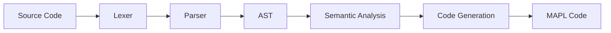

# Programming Language Implementation

English | [Español](README.es.md)

## Overview

This project implements a small programming language whose syntax is inspired by TypeScript.

The compiler is organized into the following phases:

1. Lexical analysis
2. Syntax analysis
3. Semantic analysis
4. Code generation

The implementation is written in Java and uses ANTLR for parser generation and MAPL for code generation.

**University of Oviedo**
Bachelor's Degree in Software Engineering
Third Year

**Course:** Programming Language Design (DLP)

## Example Program

```text
let v:[10]number;

// Main program
function main(): void {
    let value: number;
    let i,j: int;
    let date: [
        let day, month, year:int;
    ];

    input date.day;
    date.year = 'a';
    date.month = date.day * date.year % 12 + 1;
    log date.day, '\n', date.month, '\n', (date.year as number), '\n';

    input value;

    i = 0;
    while (i < 10) {
        v[i] = value;
        log i, ':', v[i], ' ';

        if (i % 2)
            log 'o', 'd', 'd', '\n';
        else
            log 'e', 'v', 'e', 'n', '\n';

        i = i + 1;
    }

    log '\n';
}
```

## Language Features

> **Note:** For a complete specification of the language, see the documentation available in the `docs` directory.

### Types

- int
- number
- char
- arrays
- records

### Statements

- variable assignment
- if / else
- while
- function invocation
- return
- input / output

### Expressions

- arithmetic operators
- logical operators
- relational operators
- explicit casts

## Architecture



## AST Design


## Project Structure

| Directory     | Description                                                                                                                                                                                  |
| ------------- | -------------------------------------------------------------------------------------------------------------------------------------------------------------------------------------------- |
| `docs`        | Contains the language specification provided by the course instructor, along with several test programs used to validate the implementation                                                  |
| `lib`         | Although the project uses Maven and has very few dependencies, the two main libraries (ANTLR and Introspector) are stored here                                                               |
| `ast`         | Contains the Java classes that define the Abstract Syntax Tree (AST)                                                                                                                         |
| `parser`      | Contains the `TSMm.g4` grammar file used by ANTLR to generate the parser. It also uses `LexerHelper.java` to simplify type conversions and lexical processing                                |
| `semantic`    | Represents the core of the compiler. Using the Visitor pattern, these classes traverse the AST and apply semantic rules such as type checking, scope validation, and assignment verification |
| `symboltable` | Contains the `SymbolTable` class used during the identification phase. It is responsible for managing scopes and symbol resolution                                                           |
| `codegen`     | Implemented using the Visitor pattern and MAPL templates. This module generates the target machine code from a semantically correct program                                                  |

```
```
